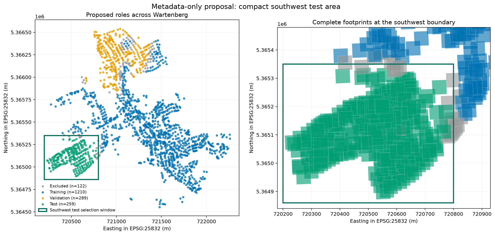

# Candidate geographic evaluation split

**Status: proposal only. It has not replaced `data/metadata/splits.json` and must
not be used to start training before review.**

## Prior development use

The saved artifacts show 1 completed
random-initialized run and 2 interrupted
ImageNet-initialized attempts under the old split. They used the same 25-image
Seed 17 training subset, and their evaluations exposed all 289 old validation
images to checkpoint selection. The real-data preflight used IDs 8 and 144 for
its small learning check; these are already in that 25-image subset. The executed
Stage 1 gallery opened six development images: 39, 74, 540, 710, 1093, 1821.

All 1,880 samples also participated in checksum, pairing, coordinate, label-code
and aggregate label-area checks. These technical audits are recorded separately:
they did not fit a model, select a checkpoint or inspect prediction errors.

## Preferred proposal

The candidate holds out a compact southwest coordinate window in EPSG:25832,
from easting 720200 to
720800 m and northing
5364860 to
5365350 m. Only complete image footprints inside
the window are eligible. The boundary was chosen from coordinates and sample
counts, outside the existing northern validation block; no image content, mask
distribution, score or prediction error was used.

| Proposed role | Images |
| --- | ---: |
| Training | 1210 |
| Validation | 289 |
| Test | 259 |
| Excluded | 122 |

The old northern validation set remains the development validation set because
it has already influenced model selection. The training pool remains large enough
for nested 25, 100 and 500-image subsets. Of the former provider test images,
140 would become development
training material, 14 fall inside
the new geographic test area, and none were previously used for model fitting or
selection. This role change must be explicit if the proposal is adopted.

The left panel shows the complete municipality and the southwest selection
window. The right panel displays full image footprints near the boundary: green
footprints are proposed test images, blue footprints remain training material,
and grey footprints are excluded. The rectangle is a selection boundary, not an
additional distance buffer.

## Leakage and exclusions

Historical use is disclosed but is not an exclusion rule for the restarted
study. The proposed test set contains three images used by the discarded pilot
for training (IDs 146, 1762 and 1782), no old validation image, and no qualitative
gallery example. The new split therefore must not be described as untouched
since the beginning of the project. Its selection remains independent of old
scores, predictions, errors and label distributions.

| Exclusion basis | Images |
| --- | ---: |
| Footprint intersects retained northern validation | 81 |
| Footprint straddles the southwest boundary | 21 |
| Exact duplicate copy | 20 |

Positive-area footprint overlaps are 0 for training–validation, training–test
and validation–test. Nearest complete-footprint distances are summarized below;
the small training–validation minimum reflects the explicit decision not to add
a buffer.

| Roles | Minimum (m) | 10th percentile (m) | Median (m) |
| --- | ---: | ---: | ---: |
| Training–validation | 0.6 | 113.4 | 591.4 |
| Training–test | 10.1 | 287.5 | 723.1 |
| Validation–test | 565.6 | 692.8 | 974.6 |

## Recommendation and limitation

This is the preferred proposal because it creates one compact, geographically
defined test area without old validation images, preserves the already exposed
northern block for validation, and leaves ample training data. It measures transfer to a held-out part of
Wartenberg, not transfer to another city. Spatial proximity remains because no
buffer is requested. Prior pilot use is a historical limitation, not a geometric
hole or a permanent role constraint in the restarted design.

If approved, the next implementation step is to create a new versioned split,
regenerate nested training subsets from its training role, update the method
documentation and start every model from fresh random or original ImageNet
weights with a newly initialized decoder. Old checkpoints remain historical and
must not be reused.
